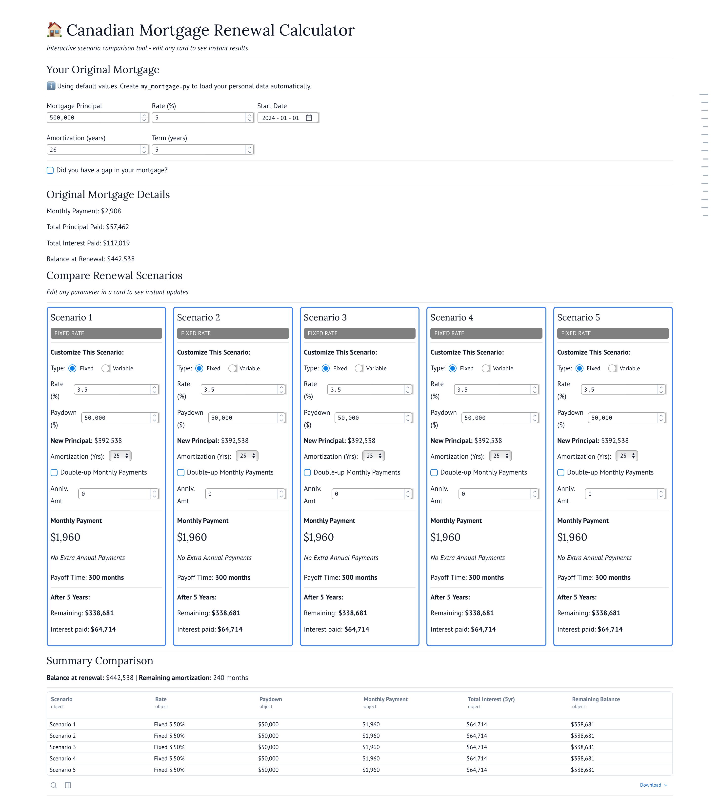

# Canadian Mortgage Calculator & Renewal Planner

A Python-based calculator for Canadian mortgages with semi-annual compounding and a comprehensive renewal scenario planner.

Available for use on molab.marimo.io using [this link](https://molab.marimo.io/notebooks/nb_QLjetPdpsxfKWaKYMtQyMp/app)



## Features

- **Canadian Mortgage Calculations**: Properly handles semi-annual compounding as used by Canadian banks
- **Amortization Schedules**: Generate detailed payment schedules showing principal/interest breakdown
- **Extra Payments**: Model the impact of annual lump-sum payments
- **Renewal Planning**: Compare multiple renewal scenarios with different rates and paydown amounts
- **Investment Analysis**: Calculate opportunity cost of principal paydown vs. investing

## Installation

```bash
# Clone the repository
git clone https://github.com/MCDAngelo/mortgage-renewal-calc.git
cd mortgage-renewal-calc

# Install dependencies
uv sync
```

## Quick Start

The easiest way to use the calculator is through the interactive Marimo web app:

```bash
uv run marimo edit mortgage_renewal_app.py
```

The app will:
- ✅ Automatically load your data from `my_mortgage.py` (if it exists)
- ✅ Provide an interactive UI for exploring scenarios
- ✅ Visualize your mortgage schedule and renewal comparisons
- ✅ Let you adjust values in real-time

**First time setup**: Create `my_mortgage.py` with your actual mortgage details, then the app will automatically use your data.

### Plan Your Renewal

```python
from mortgage_renewal import MortgageRenewalPlanner

# Create your current mortgage
current_mortgage = CanadianMortgageCalculator(
    original_principal=500000,
    annual_rate=0.0199,
    amortization_months=300,
    term_months=60,
    start_date=datetime(2020, 1, 1)
)
current_mortgage.create_full_amortization_schedule()

# Create renewal planner
planner = MortgageRenewalPlanner(current_mortgage)

# Define renewal scenarios
scenarios = [
    {
        'name': 'Conservative - no paydown',
        'new_rate': 0.045,
        'principal_paydown': 0,
        'extra_monthly_payment': 0,
        'extra_annual_payment': 0,
    },
    {
        'name': 'Aggressive - $100k paydown',
        'new_rate': 0.045,
        'principal_paydown': 100000,
        'extra_monthly_payment': 0,
        'extra_annual_payment': 20000,
    },
]

# Analyze scenarios
planner.scenario_analysis(scenarios, max_paydown=150000)

# Get results as DataFrame
results = planner.to_frame()
print(results)
```

## Project Structure

```
mortgage-renewal-calc/
├── canadian_mortgage_calculator.py  # Core calculator with Canadian compounding
├── mortgage_renewal.py              # Renewal scenario planner
├── renewal_scenario.py              # Scenario result classes
├── tests/                           # Test suite
│   ├── conftest.py                 # Shared test fixtures
│   ├── test_mortgage_calculator.py # Calculator tests
│   ├── test_renewal_planner.py     # Renewal planner tests
│   ├── test_extra_payments.py      # Extra payment tests
│   └── test_integration.py         # Integration tests
├── pytest.ini                       # Pytest configuration
├── pyproject.toml                   # Project dependencies
└── README.md                        # This file
```


### Setup Your Personal Mortgage File

The application is designed to automatically load your personal mortgage data from `my_mortgage.py`:

1. **Edit `my_mortgage.py`** with your actual mortgage details:
   ```bash
   # Open in your editor
   code my_mortgage.py  # or vim, nano, etc.
   ```

2. **Update the configuration** with your real values:
   ```python
   MY_MORTGAGE_CONFIG = {
       'original_principal': YOUR_AMOUNT,
       'annual_rate': YOUR_RATE,
       'amortization_months': YOUR_MONTHS,
       'term_months': YOUR_TERM,
       'start_date': datetime(YEAR, MONTH, DAY),
       'mortgage_gap': (START_DATE, END_DATE) or (None, None),
   }
   ```

3. **Run the Marimo app** - it will automatically use your data:
   ```bash
   uv run marimo run mortgage_renewal_app.py
   ```

4. **Or run Python scripts**:
   ```bash
   uv run python my_mortgage.py
   ```


## How Canadian Mortgages Work

Canadian mortgages use **semi-annual compounding** but can be paid monthly. This differs from US mortgages which typically use monthly compounding.

### Calculation Process

1. **Semi-annual rate**: `annual_rate / 2`
2. **Effective annual rate**: `(1 + semi_annual_rate)² - 1`
3. **Monthly rate**: `(1 + effective_annual_rate)^(1/12) - 1`
4. **Payment**: Standard annuity formula with monthly rate

This calculator implements the formula used by Canadian banks.

## Features Explained

### Extra Annual Payments

Canadian mortgages typically allow annual lump-sum payments up to 10-20% of the original principal. These payments:
- Go directly to principal
- Reduce interest costs over the life of the mortgage
- Can significantly reduce the amortization period

### Mortgage Gaps

The calculator supports payment gaps (e.g., if you stopped payments when transferring a mortgage during a move with a gap between closing and possession):

```python
mortgage = CanadianMortgageCalculator(
    original_principal=500000,
    annual_rate=0.05,
    amortization_months=300,
    term_months=60,
    start_date=datetime(2020, 1, 1),
    mortgage_gap=(datetime(2022, 5, 1), datetime(2022, 8, 1))  # 3 month gap
)
```

## Contributing

Contributions are welcome! Please:
1. Fork the repository
2. Create a feature branch
3. Add tests for new features
4. Ensure all tests pass
5. Submit a pull request

## License

This project is licensed under the MIT License - see the [LICENSE](LICENSE) file for details.

Copyright (c) 2025 Maria D'Angelo

## Disclaimer

This calculator is for educational and planning purposes only. Always verify calculations with your lender or financial advisor before making financial decisions.

